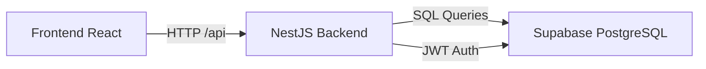

# Central de Onboarding Maiver

> **Versão:** 1.0.0
> **Status:** ✅ MVP Completo

Sistema interno para gerenciamento de onboarding de novos clientes da Maiver.

---

## 📋 Sumário

- [Sobre](#-sobre-o-projeto)
- [Stack Tecnológica](#-stack-tecnológica)
- [Funcionalidades](#-funcionalidades)
- [Arquitetura](#-arquitetura)
- [Pré-requisitos](#-pré-requisitos)
- [Instalação](#-instalação)
- [Configuração](#-configuração)
- [Uso](#-uso)
- [API](#-api)
- [Testes](#-testes)
- [Deploy](#-deploy)
- [Estrutura do Projeto](#-estrutura-do-projeto)
- [Diário de Uso da IA](#-diário-de-uso-da-ia)

---

## 📋 Sobre o Projeto

A **Central de Onboarding Maiver** é um MVP que permite aos consultores da Maiver:

- 📝 **Cadastrar** novos clientes com dados de contato e plano contratado
- 📋 **Gerenciar** um checklist de 6 etapas de onboarding para cada cliente
- 📊 **Acompanhar** o progresso dos clientes em um dashboard visual
- 🔍 **Filtrar** clientes por nome da empresa, consultor responsável ou contato
- ⏰ **Identificar** atrasos automaticamente (clientes com mais de 30 dias sem conclusão)

## 🛠️ Stack Tecnológica

| Camada | Tecnologia | Versão |
|--------|-----------|--------|
| **Frontend** | React + Vite + TypeScript | ^18 / ^5 |
| **Backend** | NestJS + TypeScript | ^10 |
| **Banco de Dados** | Supabase (PostgreSQL) | - |
| **Testes (Backend)** | Jest | ^29 |
| **Testes (Frontend)** | Vitest + Testing Library | - |

## ✨ Funcionalidades

### Dashboard
- Cards com progresso individual de cada cliente (ex: `4/6`)
- Status automático: **Em andamento**, **Concluído** ou **Atrasado**
- Estatísticas: Total, Em andamento, Concluídos, Atrasados
- Filtro dinâmico por nome da empresa, consultor ou contato
- Loading skeleton com efeito shimmer

### Cadastro de Clientes
- Formulário com validação de campos obrigatórios
- Planos disponíveis: Básico, Pro, Enterprise
- Data de início do onboarding

### Checklist de Onboarding
- 6 etapas predefinidas:
  1. Reunião de kickoff realizada
  2. Acesso à plataforma configurado
  3. Integração de SMS ativada
  4. Primeiro fluxo de recuperação criado
  5. Treinamento do time do cliente concluído
  6. Go-live aprovado
- Marcar/desmarcar etapas como concluídas
- Adicionar notas a cada etapa
- Cálculo automático de progresso e status

## 🏗️ Arquitetura



**Fluxo de dados:**
1. Frontend faz requisições HTTP para o backend
2. Backend (NestJS) processa e consulta o Supabase
3. Supabase retorna os dados, backend calcula status e progresso
4. Frontend exibe no dashboard com filtros dinâmicos

## 📋 Pré-requisitos

- Node.js >= 18
- npm >= 9
- Conta no [Supabase](https://supabase.com) (gratuita)

## 📦 Instalação

```bash
# Clone o repositório
git clone https://github.com/DanielCamucatto/teste-onbording-maiver.git
cd teste-onbording-maiver

# Instalar dependências do backend
cd backend
npm install

# Instalar dependências do frontend
cd ../frontend
npm install
```

## ⚙️ Configuração

### 1. Supabase

1. Crie um projeto no [Supabase](https://supabase.com/dashboard)
2. No **SQL Editor**, execute o conteúdo do arquivo `supabase/schema.sql`
3. Vá em **Project Settings > API** e copie:
   - `Project URL`
   - `anon public` key

### 2. Backend

Crie o arquivo `backend/.env`:

```env
PORT=3001
SUPABASE_URL=https://seu-projeto.supabase.co
SUPABASE_ANON_KEY=sua-chave-anon-publica
```

### 3. Frontend

O frontend usa proxy do Vite. Verifique `frontend/vite.config.ts`:

```ts
server: {
  proxy: {
    '/api': {
      target: 'http://localhost:3001',
      changeOrigin: true,
    },
  },
},
```

## 🚀 Uso

```bash
# Terminal 1 - Backend
cd backend
npm run start:dev
# Rodando em http://localhost:3001

# Terminal 2 - Frontend
cd frontend
npm run dev
# Rodando em http://localhost:5173
```

Acesse **http://localhost:5173** no navegador.

## 📡 API

### Clientes

| Método | Rota | Descrição |
|--------|------|-----------|
| `GET` | `/api/clients` | Lista todos os clientes |
| `POST` | `/api/clients` | Cria um novo cliente |
| `GET` | `/api/clients/:id` | Busca cliente por ID |

**POST /api/clients** — Exemplo de body:
```json
{
  "company_name": "TechSolutions Ltda",
  "contact_name": "Carlos Silva",
  "email": "carlos@techsolutions.com",
  "phone": "(11) 99999-8888",
  "plan": "Pro",
  "start_date": "2025-05-15",
  "consultant_name": "Jeferson Oliveira"
}
```

### Onboarding

| Método | Rota | Descrição |
|--------|------|-----------|
| `POST` | `/api/onboarding/:clientId/steps` | Cria as 6 etapas para o cliente |
| `GET` | `/api/onboarding/:clientId` | Lista etapas de um cliente |
| `PATCH` | `/api/onboarding/:clientId/steps/:stepId` | Atualiza etapa (completar/nota) |

**PATCH /api/onboarding/:clientId/steps/:stepId**:
```json
{
  "completed": true,
  "note": "Kickoff realizado com sucesso!"
}
```

### Dashboard

| Método | Rota | Descrição |
|--------|------|-----------|
| `GET` | `/api/dashboard` | Lista clientes com progresso e status |
| `GET` | `/api/dashboard?consultor=Nome` | Filtra por consultor |

## 🧪 Testes

```bash
# Backend (25 testes unitários)
cd backend && npm test

# Com cobertura
cd backend && npm run test:cov

# Frontend
cd frontend && npm test
```

**Suites de teste:**
| Serviço | Testes | Cobertura |
|---------|--------|-----------|
| `DashboardService` | 7 | Cálculo de status (ativo/concluído/atrasado), filtro, erros |
| `ClientsService` | 8 | CRUD, busca por ID, filtro por consultor, erros |
| `OnboardingService` | 10 | Criação de etapas, listagem, conclusão, notas, erros |

**Status dos testes:** `25 passed, 25 total` ✅

## 🚀 Deploy

### Frontend (Netlify)

**Frontend deployado via Netlify CLI:**

```bash
cd frontend && ntl deploy --build --prod
```

**URL de producao:** [https://zippy-syrniki-637494.netlify.app](https://zippy-syrniki-637494.netlify.app)

### Backend (Render)

**Backend deployado via GitHub (push automatico):**

O Render esta conectado ao repositorio GitHub. A cada push na branch `main`, o Render:
1. Clona o repositorio
2. Executa `npm install && npm run build`
3. Inicia com `node dist/main.js`

**URL de producao:** [https://maiver-onboarding-backend.onrender.com](https://maiver-onboarding-backend.onrender.com)

### Pipeline CI/CD (GitHub Actions)

O repositorio possui uma pipeline automatizada em `.github/workflows/ci-cd.yml`:

```yaml
# Fluxo:
# 1. Push na main -> dispara pipeline
# 2. test-backend: type check + testes unitarios + build
# 3. test-frontend: type check + build
# 4. deploy-frontend: deploy automatico no Netlify
```

**Secrets necessarios no GitHub (Settings > Secrets and variables > Actions):**

| Secret | Descricao |
|--------|-----------|
| `NETLIFY_AUTH_TOKEN` | Token de acesso do Netlify |
| `NETLIFY_SITE_ID` | ID do site no Netlify |
| `VITE_API_URL` | URL do backend no Render |

> **Nota:** O backend do Render usa deploy automatico via integracao nativa com GitHub, sem necessidade de Deploy Hook.

## 📁 Estrutura do Projeto

```
teste-onbording-maiver/
├── backend/
│   ├── src/
│   │   ├── clients/         # Módulo de clientes (CRUD)
│   │   ├── dashboard/       # Módulo de dashboard (status/progresso)
│   │   ├── onboarding/      # Módulo de onboarding (etapas)
│   │   ├── common/          # Constantes, interfaces, DTOs
│   │   ├── database/        # Conexão Supabase
│   │   └── main.ts          # Entry point
│   ├── dist/                # Build (gerado)
│   ├── package.json
│   └── tsconfig.json
├── frontend/
│   ├── src/
│   │   ├── components/      # Componentes reutilizáveis
│   │   ├── controllers/     # Hooks personalizados
│   │   ├── views/           # Páginas/Views
│   │   ├── api/             # Chamadas HTTP
│   │   └── styles/          # Estilos globais
│   ├── public/
│   ├── package.json
│   └── vite.config.ts
├── supabase/
│   └── schema.sql           # Script SQL do banco
└── README.md
```

## 📝 Diário de Uso da IA

### 1. Quais ferramentas de IA você usou e por quê?

**Claude (claude-3.5-sonnet) — Cursor IDE**

Usei o Claude integrado ao Cursor como assistente principal de desenvolvimento por sua capacidade de entender contexto completo do projeto (arquivos abertos, estrutura, terminal). Diferente de chatbots avulsos, o Cursor permite que a IA leia arquivos específicos, execute comandos no terminal e edite código diretamente, agilizando o fluxo de trabalho.

Escolhi o Claude especificamente por:
- **Entendimento contextual**: Conseguia manter o contexto do projeto entre prompts, lembrando de decisões anteriores
- **Geração de código funcional**: Produziu código TypeScript/React/NestJS com poucos erros de sintaxe
- **Depuração integrada**: Quando algo quebrava, a IA podia ler logs do terminal e sugerir correções
- **Edição direta**: Diferente de copiar/colar respostas, a IA modificava arquivos existentes preservando indentação e estrutura

### 2. Mostre 2 ou 3 prompts que você usou

**Prompt 1 — Criação inicial do backend:**
> "Crie um projeto NestJS completo com módulos Clients, Onboarding e Dashboard. Use Supabase como banco. Inclua DTOs validação com class-validator, constantes com as 6 etapas de onboarding, e RLS policies no SQL schema. O dashboard deve calcular status: Em andamento (< 30 dias), Atrasado (> 30 dias), Concluído (6/6 etapas)."

**Prompt 2 — Correção de filtro dinâmico:**
> "Estou tentando filtrar por consultor e não estou conseguindo, nem por nome da empresa também. O FilterBar tem um input de texto, mas não está filtrando nada. Verifica o componente e o backend."

**Prompt 3 — Implementação de loading skeleton:**
> "A procura pelos responsáveis Pedro e Ana não derão certo o resto deu certo, além disso notei que o loading é aqueles antigos que ficam rodando, acho que seria mais interessante fazer em skeleton. O skeleton precisa seguir o layout completo da página: título, stats e cards."

### 3. Qual parte do MVP foi mais difícil de construir com IA?

**A parte mais desafiadora foi lidar com os mocks do Supabase nos testes unitários.**

O Supabase Client usa um PostgrestQueryBuilder com encadeamento de métodos (`.from().select().eq().order()`), onde métodos intermediários retornam `this` para continuar o chain, e apenas os métodos terminais retornam Promises. 

A IA gerou mocks que não capturavam corretamente esse comportamento — algumas vezes o `.select()` retornava Promise quando deveria retornar `this`, outras vezes o `.single()` não resolvia corretamente. Foram necessárias 5 rodadas de correção até que os 25 testes passassem.

**Outro desafio** foi o filtro dinâmico. Inicialmente o FilterBar usava `onSubmit` (submissão de formulário), e a IA sugeriu trocar para `onChange` com debounce. A implementação inicial causava loops de renderização porque o `useEffect` no FilterBar chamava `onFilter` que atualizava o estado pai que re-renderizava o FilterBar. Foi preciso usar `useCallback` e debounce de 200ms para estabilizar.

### 4. O que você escolheu não construir?

Por ser um MVP, deliberadamente optei por **não implementar**:

- **Autenticação/autorização**: O sistema atual permite acesso anônimo completo (RLS com permissão para `anon`). Em produção, seria necessário login com Supabase Auth e políticas por consultor.
- **CRUD completo de etapas**: Não é possível editar o nome das etapas, reordená-las ou adicionar etapas customizadas. O checklist é fixo com 6 etapas.
- **Notificações**: Não há alertas por e-mail ou notificação quando um onboarding está próximo do vencimento.
- **Histórico de alterações**: Não há logs de quem alterou o quê e quando.
- **Dashboard com gráficos**: O dashboard mostra apenas cards e estatísticas numéricas, sem gráficos de evolução temporal.
- **Paginação**: Com poucos clientes no MVP, não implementei paginação na listagem.
- **Modo escuro**: A UI já nasceu escura (dark mode), mas sem toggle para light mode.
- **Testes de frontend**: Embora configurados (Vitest + Testing Library), não foram implementados por questão de escopo.
- **CI/CD**: Pipeline de integração contínua configurada com GitHub Actions (.github/workflows/ci-cd.yml). A cada push na main, os testes rodam automaticamente e, se passarem, o frontend é deployado no Netlify. O backend faz deploy automático via integração nativa do Render com o GitHub.

### 5. O que você faria diferente?

**Usaria o Supabase Client SDK de forma mais direta**

Em vez de criar uma estrutura NestJS com providers customizados (injeção do `SUPABASE_CLIENT`), usaria o **Supabase Client diretamente nos serviços** com o módulo `@supabase/supabase-js` sem camadas extras de abstração. Isso teria simplificado os mocks nos testes e reduzido a complexidade do código.

**Testaria o mock do Supabase antes de escrever os services**

O maior gargalo foi o mock do PostgrestQueryBuilder. Se eu tivesse verificado primeiro como mockar corretamente o encadeamento de métodos do Supabase, teria economizado várias iterações de correção nos testes. Sugiro para projetos futuros: criar um **helper de mock do Supabase** reutilizável.

**Usaria debounce no frontend desde o início**

O filtro começou com `onSubmit` e depois migrou para `onChange` com debounce. Se tivesse implementado com debounce desde o começo, teria evitado a refatoração do FilterBar.

**Separaria as responsabilidades do dashboard**

O cálculo de status (`calculateStatus`) está dentro do `DashboardService` como método privado. Para testabilidade, deveria ser um **helper/service separado** ou exportado. Tive que testá-lo indiretamente via `getDashboard()`, o que tornou os testes mais verbosos.

**Adicionaria tipagem mais rigorosa**

Os DTOs usam `class-validator`, mas as respostas do Supabase são tipadas como `as Client[]` ou `as OnboardingStep[]`. Um schema de validação com Zod ou uma camada de transformação teria dado mais segurança.

---

## 📄 Licença

Projeto interno Maiver © 2025
